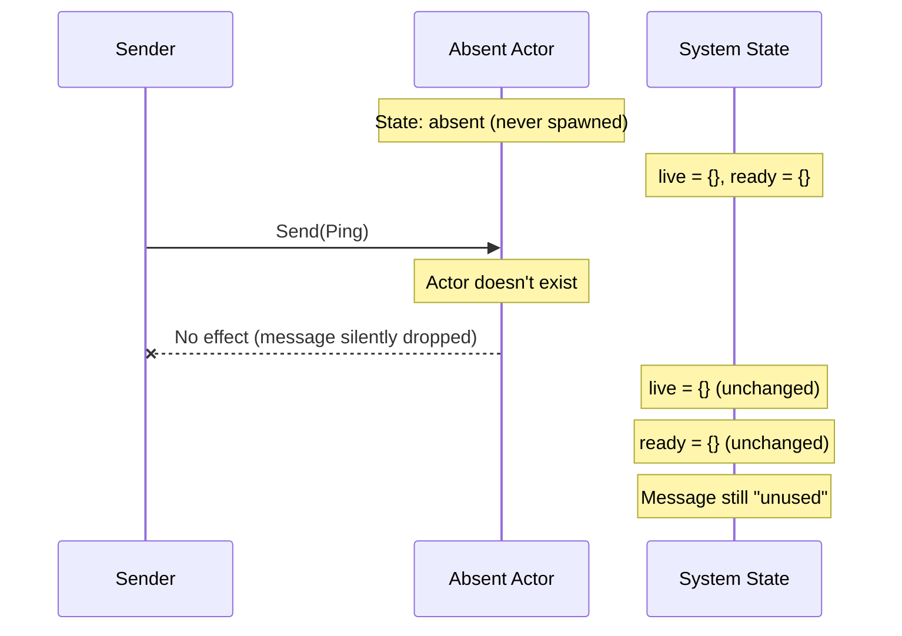
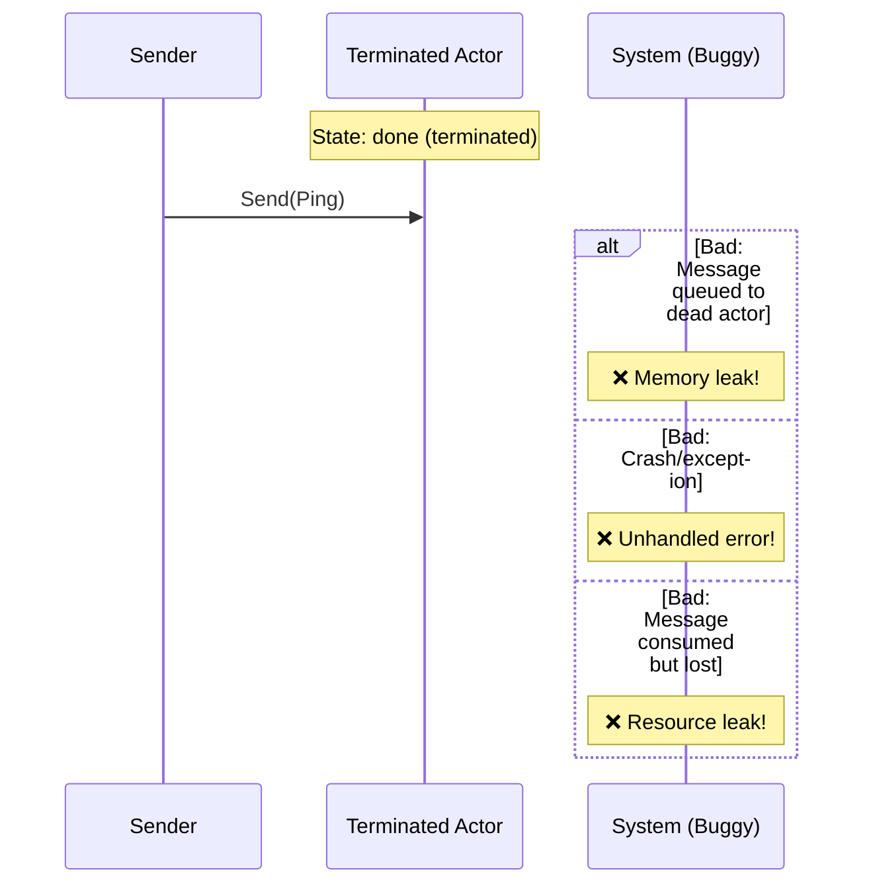

# Missing Actor Send

**What this verifies:** Sending a message to a non-existent (absent) actor is a safe no-op—nothing breaks, and no resources are leaked.

## The Property

In a dynamic actor system, actors come and go. Code might try to send a message to an actor that:
- Was never spawned
- Already terminated
- Is referenced by a stale handle

The specification verifies that sending to such an actor has no effect—the message is not queued, not consumed, and no state changes occur.

## Scenario



## Why This Matters



A buggy implementation might:
- Queue messages to dead actors (memory leak)
- Crash or throw an exception (fragile system)
- Consume message IDs but not deliver them (resource exhaustion)

## The Invariant

```
MissingActorSendOutcome ==
  /\ live = {}
  /\ ready = {}
  /\ msg_state[FirstMessageId] = "unused"
  /\ mailboxes[ScenarioActor] = <<>>
  /\ pending_result[ScenarioActor] = NoPending
```

**In plain English:** After attempting to send, the system state is exactly as if nothing happened:
- No actors became live
- No actors are ready
- The message ID was not consumed
- No mailbox has any messages
- No pending results exist

## Implementation Connection

In Agner, this is implemented in `Send(target, msg)`:
```tla
IF target \in live THEN
  \* ... deliver message ...
ELSE
  UNCHANGED vars  \* Safe no-op
```

This models `SchedulerBase::send()` checking actor liveness before enqueuing.

## Running This Spec

```bash
cd spec/core/contract/messaging/missing_actor_send
java -jar tla2tools.jar -modelcheck -config missing_actor_send.cfg missing_actor_send.tla
```
