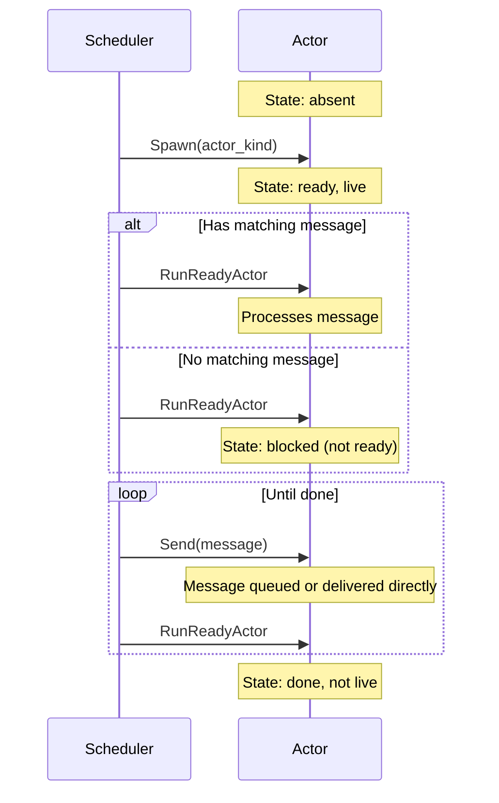

# Core System Full Exploration

**What this verifies:** All core actor system invariants hold across the full state space of spawning, sending, and scheduling.

## Overview

This is the "stress test" specification. It explores every possible combination of:
- Spawning actors of different types (collector, sequence, timeout)
- Sending messages to any actor
- Running any ready actor
- Advancing time and firing timeouts

The model checker exhaustively explores all interleavings to verify that the system's invariants never break.

## Actor Lifecycle



## What Invariants Are Checked

| Invariant | Plain English |
|-----------|---------------|
| **ReadyActorsAreLive** | You can't run a dead actor |
| **PendingResultsAreReady** | If an actor has a pending message, it must be scheduled to run |
| **BlockedActorsHaveNoMatches** | If an actor is blocked waiting, there's nothing in its mailbox it could process |
| **TimerDiscipline** | Only blocked actors waiting with a timeout can have timers set |
| **CompletedActorsClearedState** | Finished actors have empty mailboxes and no pending state |
| **MessageOwnership** | Every message is in exactly one state: unused, queued, pending, observed, or dropped |

## Running This Spec

```bash
cd spec/core/coordination/core/core_system
# Using TLC directly
java -jar tla2tools.jar -modelcheck -config core_system.cfg core_system.tla
```

## State Space

With default constants (`ActorPool = {a1, a2}`, `MessageIds = {m1, m2}`), the model explores ~10,000+ states covering all actor lifecycle combinations.
