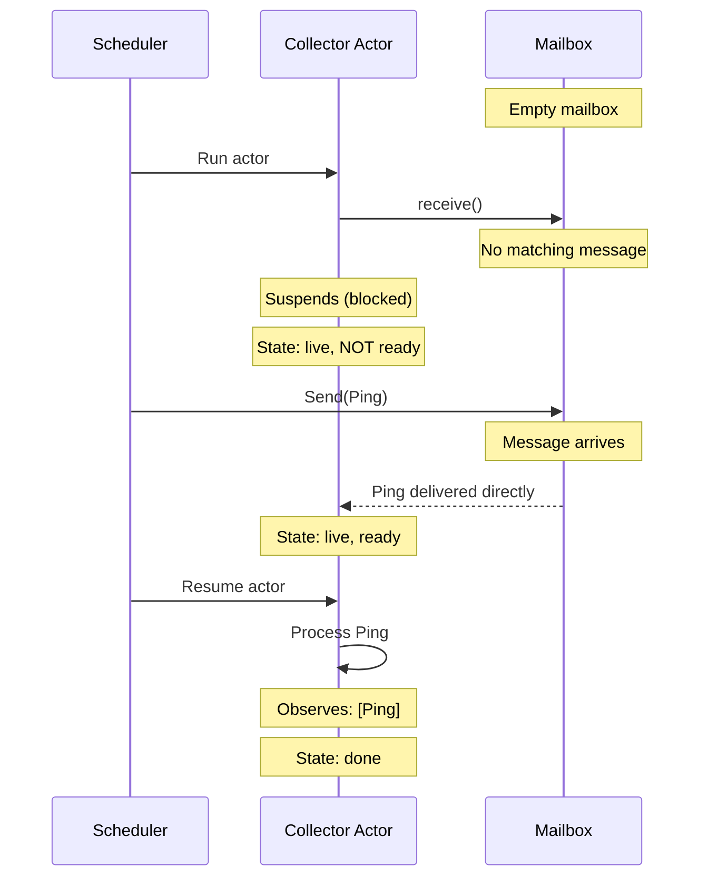
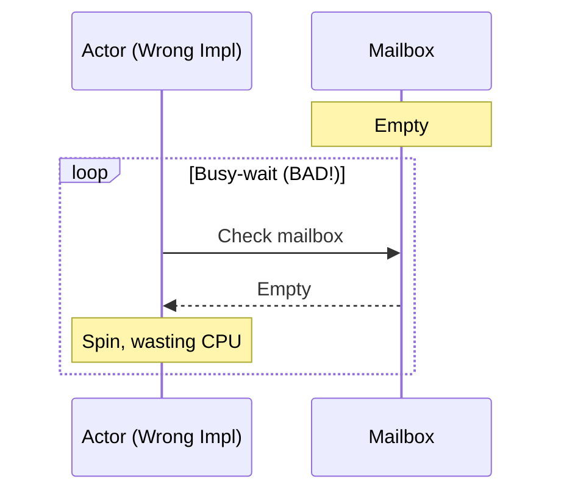

# Receive Suspends

**What this verifies:** When an actor calls `receive()` and no matching message exists, it suspends until one arrives.

## The Property

An actor that calls `receive()` with an empty mailbox should:
1. Suspend (not spin or busy-wait)
2. Automatically resume when a matching message arrives
3. Correctly observe the message that woke it up

## Scenario Setup



## Why This Matters



A naive implementation might poll the mailbox in a loop. This specification verifies that the actor framework correctly:
- Removes the actor from the ready set when blocked
- Delivers messages directly to blocked actors (pending_result)
- Re-adds the actor to the ready set when a message arrives

## The Invariant

```
ReceiveSuspendsOutcome ==
  pc[ScenarioActor] # "done" \/
  ObservationValues(observations[ScenarioActor]) = <<FirstPayload>>
```

**In plain English:** When the actor finishes, it must have observed exactly the message that was sent while it was waiting.

## Related Invariants

This scenario also verifies:
- **BlockedActorsHaveNoMatches**: The actor only blocks when there's truly nothing to process
- **PendingResultsAreReady**: Once a message arrives, the actor is immediately schedulable

## Running This Spec

```bash
cd spec/core/coordination/mailbox/receive_suspends
java -jar tla2tools.jar -modelcheck -config receive_suspends.cfg receive_suspends.tla
```
