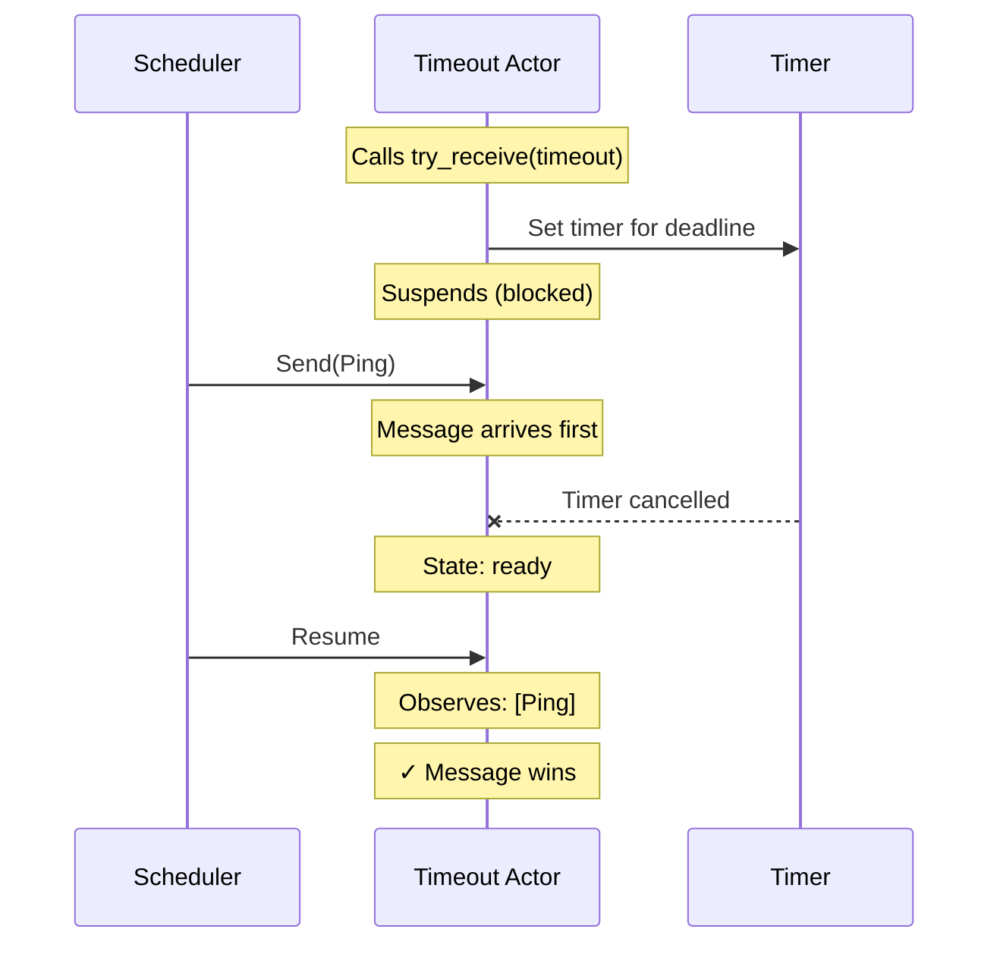
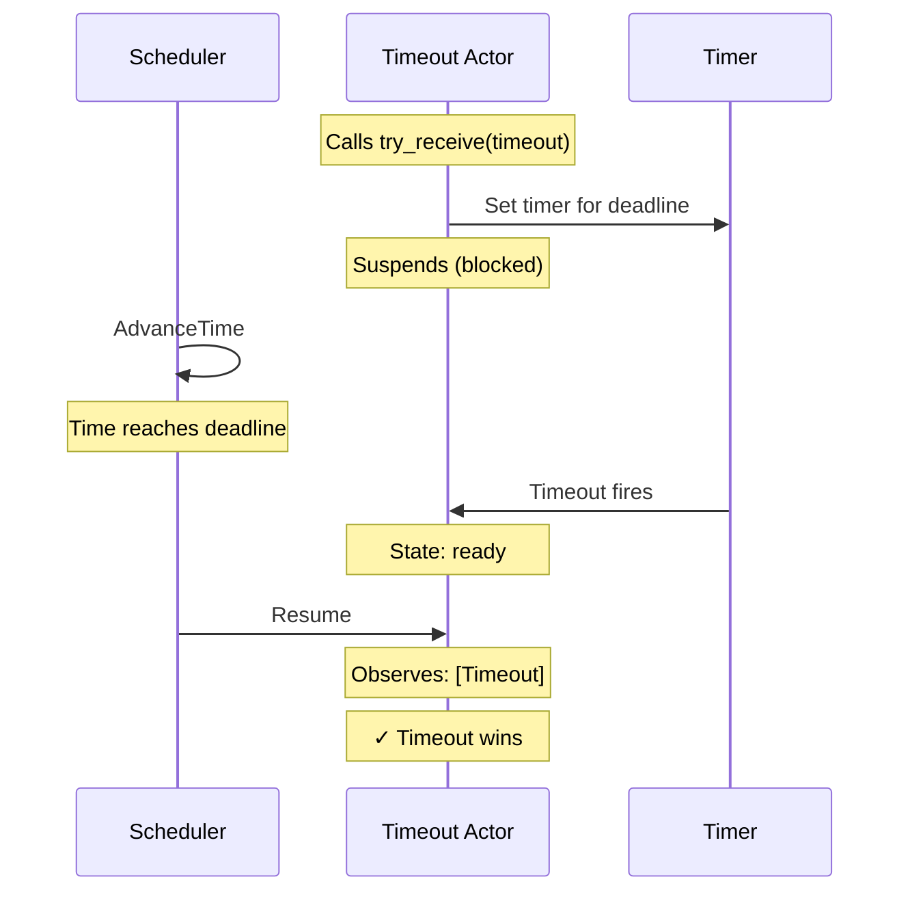
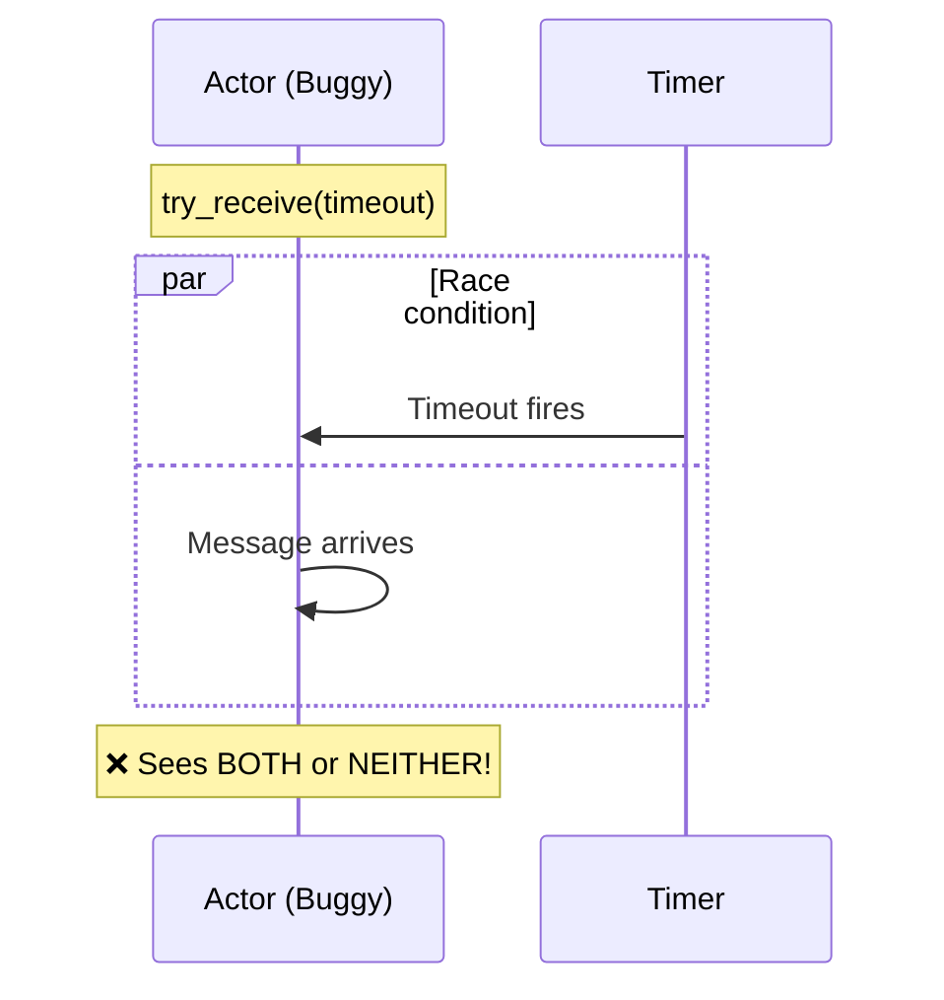

# Try-Receive Race

**What this verifies:** When an actor uses `try_receive()` with a timeout, it observes exactly one outcome—either the message OR the timeout, never both or neither.

## The Property

An actor that waits for a message with a timeout faces a race condition:
- A message might arrive before the timeout
- The timeout might fire before any message arrives
- They might "tie" (arrive at the same logical instant)

The specification verifies that the actor always observes **exactly one** outcome, regardless of timing.

## Scenario: Message Wins



## Scenario: Timeout Wins



## What Could Go Wrong



Without proper synchronization, the actor could:
- See both the message and the timeout (double-delivery)
- See neither (lost wakeup)
- Corrupt internal state

## The Invariant

```
TryReceiveOutcome ==
  pc[ScenarioActor] # "done" \/
  /\ Len(observations[ScenarioActor]) = 1
  /\ (
       /\ observations[ScenarioActor][1].kind = "Ping"
       /\ observations[ScenarioActor][1].value = FirstPayload
     \/ observations[ScenarioActor][1] = TimeoutToken
     )
```

**In plain English:** When the actor finishes, it observed exactly one thing—either the Ping message OR the Timeout token.

## Related Invariants

- **TimerDiscipline**: Timers are only active on blocked try-receive actors
- **PendingResultsAreReady**: Whether message or timeout, the actor becomes ready

## Running This Spec

```bash
cd spec/core/timing/timeouts/try_receive_race
java -jar tla2tools.jar -modelcheck -config try_receive_race.cfg try_receive_race.tla
```
